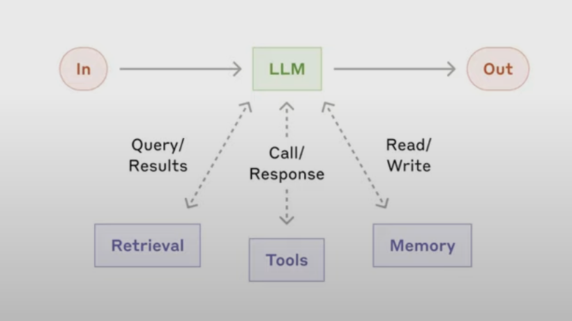

## Next steps:

_2/2/25_

task now is to figure out how to map our user profile unto exa AI search API to get a truly tailored search request

_1/2/25_

define toolcall that will evaluate for profile completeness

start exploring how to pass this 'full' profile into exa AI

_26/1/25:_

#### Getting structured output in UserProfile correctly

`prompter.py`: with pydanticAI is still kinda wonky, in beta.

try `instructor` library next

our main issue right now is creating the prompt refiner logic with structured output that is:

1. strictly adhered to
2. not hallucinated to fill in the gaps by the LLM (which if you run `prompter.py` rn is what the LLM does)

right now, with pydanticAI + openAI API directly, we get the structured schema back, but its hallucinating its contents.

im thinking instead of getting the UserProfile filled up by the LLM via chat prompt, that we instead get a mix of dynamic + statically generated input fields on a form that correlates to that first prompt that the user sends in.

#### to get structured data, openAI API directly seems promising

https://www.youtube.com/watch?v=fuMKrKlaku4&t=500s

#### Overall pipeline

And it needs to be a very structured pipeline:

#### Setting up the correct chat mechanism

this still WIP: need to study https://ai.pydantic.dev/examples/chat-app/

_20/1/25:_

ok exa api method script pretty much done.

next to build a prompt refiner logic layer, that will ask users targeted questions in trying to build a more cohesive and complete profile of them --> look into pydanticAI

_19/1/25:_

- look into pydantic AI, seems like it does a lot of the agent creation under the hood for us extremely conveniently !
